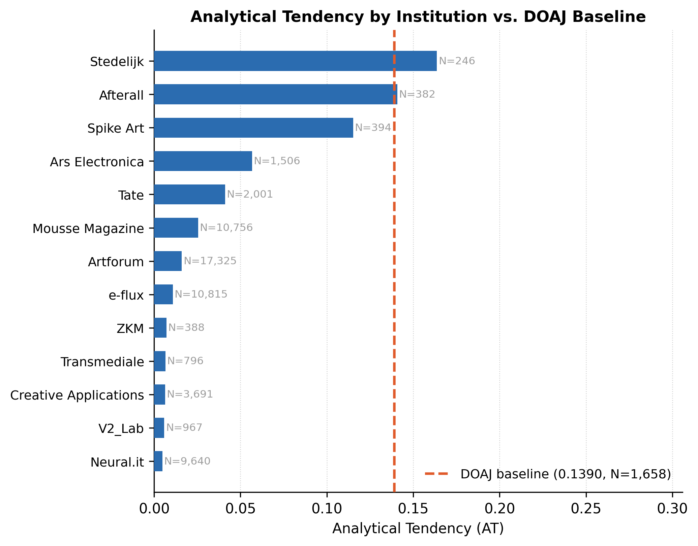
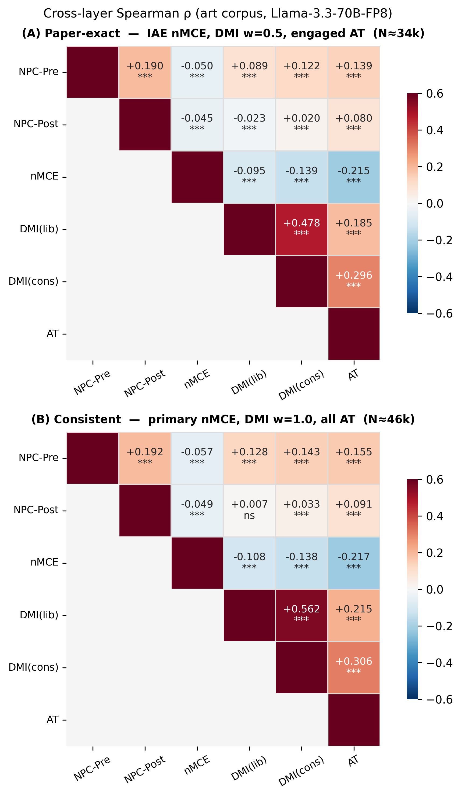

# Rhetorical Invocation: Replication Repository

Replication code and data for:

> **Rhetorical Invocation: A Four-Layer Computational Analysis of Discourse Vocabulary in Institutional Art Writing**
>
> Haram Choi, 2026
>
> <https://doi.org/10.31235/osf.io/4au72_v2>

---

## Key Results

<table>
<tc>
<td width="50%">

**Fig. 1 — Analytical Tendency by Institution**

Every art institution falls below the DOAJ peer-reviewed baseline (AT = 0.139).
Art corpus mean: AT = 0.052 (3.54× below DOAJ).



</td>
<td width="50%">

**Fig. 5 — Cross-layer Spearman ρ**

NPC-Post × DMI(lib) ≈ 0 confirms layer independence.
nMCE × AT < 0 and DMI(cons) × AT > 0 reflect orthogonal engagement dimensions.



</td>
</tc>
</table>

All five figures with detailed captions: [`figures/README.md`](figures/README.md)

---

## Quick Start

```bash
git clone https://github.com/oudeis01/rhetorical_invocation
cd rhetorical_invocation

pip install -r requirements.txt

# Reproduce all four layers
python analysis/layer1_npc.py
python analysis/layer2_nmce.py
python analysis/layer3_dmi.py
python analysis/layer4_at.py
python analysis/cross_layer.py

# Regenerate figures
python scripts/generate_figures.py
```

Results are written to `output/`. Figures are written to `figures/`.

---

## Repository Structure

```
rhetorical_invocation/
├── analysis/
│   ├── layer1_npc.py               Section 4: Noun Phrase Complexity
│   ├── layer2_nmce.py              Section 5: Normalized Modifier Concentration Entropy
│   ├── layer3_dmi.py               Section 6: Discourse Marker Interaction
│   ├── layer4_at.py                Section 7: Analytical Tendency (logprob-based)
│   ├── cross_layer.py              Section 8: Cross-layer Spearman correlation
│   └── collocation_concentration.py  Table 5.0: Corpus-level collocation top-1 share
│
├── data/
│   ├── README.md
│   ├── npc_scores.jsonl.gz          NPC scores per document (file-level)
│   ├── nmce_scores.jsonl.gz         Adjective counters per document (file-level)
│   ├── dmi_scores.jsonl.gz          DMI scores per document (file-level)
│   ├── at_scores_llama.jsonl.gz     Logprob pairs, Llama-3.3-70B-Instruct-FP8
│   ├── at_scores_qwen.jsonl.gz      Logprob pairs, Qwen-2.5-72B-Instruct-FP8
│   ├── discourse_keywords.json      530 keywords across 8 discourses
│   └── url_category_map.json.gz     URL → {institution, category} mapping
│
├── figures/
│   ├── README.md                    All figures with detailed captions
│   ├── fig1_at_institution.png
│   ├── fig2_at_format.png
│   ├── fig3_nmce_distribution.png
│   ├── fig4_dmi_zerorate.png
│   ├── fig5_crosslayer_heatmap.png
│   └── fig5_crosslayer_heatmap_vertical.png
│
├── scripts/
│   ├── build_npc_scores.py          Build npc_scores.jsonl.gz (workstation)
│   ├── build_nmce_scores.py         Build nmce_scores.jsonl.gz (workstation)
│   ├── build_dmi_scores.py          Build dmi_scores.jsonl.gz (workstation)
│   ├── build_at_scores.py           Build at_scores_*.jsonl.gz (workstation)
│   ├── generate_figures.py          Generate all five figures from data/
│   └── run_npc_ars_only.py          Re-run NPC for ars_electronica (workstation)
│
├── docs/
│   ├── pipeline_overview.md         Full pipeline description
│   ├── corpus_construction.md       Crawling methodology (documentation only)
│   ├── llm_preprocessing.md         LLM filter methodology (documentation only)
│   └── prompts/
│       ├── depth_rubric.md          L0–L5 rubric (standalone citable)
│       ├── layer4_system_prompt.md  System prompt template
│       └── layer4_user_prompt.md    User prompt template
│
├── output/                          Generated results (gitignored except .gitkeep)
├── requirements.txt
├── LICENSE                          MIT (code)
└── LICENSE_DATA                     CC BY 4.0 (derived data)
```

---

## Data

### Included in this repository

Each layer uses its own data file, preserving the original analysis unit
(file-level counts, not URL-deduplicated):

| File | N (art) | N (DOAJ) | Contents |
|------|--------:|--------:|----------|
| `npc_scores.jsonl.gz` | 60,664 | 1,660 | `npc_pre`, `npc_post`, `total_nouns` per document |
| `nmce_scores.jsonl.gz` | 59,968 | 1,679 | Raw `adj_counter` dict + `total_nouns` per document |
| `dmi_scores.jsonl.gz` | 62,655 | 1,673 | `dmi_liberal`, `dmi_conservative`, keyword counts |
| `at_scores_llama.jsonl.gz` | 177,123 pairs / 60,777 docs | 10,143 pairs / 1,673 docs | Logprob pairs, Llama-3.3-70B-FP8 |
| `at_scores_qwen.jsonl.gz` | 77,219 pairs | 6,586 pairs | Logprob pairs, Qwen-2.5-72B-FP8 |

Additional files:
- `discourse_keywords.json` — 530 discourse keywords across 8 categories
- `url_category_map.json.gz` — URL → `{institution, category}` for 60,480 art documents

### Data schemas

**`npc_scores.jsonl.gz`**
```json
{"url": "https://...", "institution": "artforum",
 "total_nouns": 312, "npc_pre": 0.221, "npc_post": 0.318}
```

**`nmce_scores.jsonl.gz`**
```json
{"url": "https://...", "institution": "moussemagazine",
 "adj_counter": {"critical": 4, "contemporary": 2, ...}, "total_nouns": 289}
```

**`dmi_scores.jsonl.gz`**
```json
{"url": "https://...", "institution": "e-flux",
 "total_keyword_matches": 14,
 "dmi_liberal": 0.0714, "dmi_conservative": 0.0,
 "dmi_zero": false,
 "dmi_csv_liberal": 0.0357, "dmi_csv_conservative": 0.0}
```
> Note: `dmi_liberal`/`dmi_conservative` use contrast weight w = 1.0 (paper §6).
> `dmi_csv_liberal`/`dmi_csv_conservative` preserve the original w = 0.5 output,
> used by `cross_layer.py` (mode A, paper-exact).

**`at_scores_llama.jsonl.gz`**
```json
{"doc_id": "https://...", "institution": "afterall", "discourse": "postcolonial",
 "at_value": 0.0086,
 "top_alternatives": [{"token": "3", "prob": 0.9914}, {"token": "4", "prob": 0.0086}]}
```

---

## Analysis Scripts

Each script reads from `data/` and writes JSON results to `output/`.
All scripts accept `--help` for options.

### Section 4 — NPC (`analysis/layer1_npc.py`)

Reproduces **§4, Table 4.1**: NPC aggregate (pre/post), Cohen's d, TOST equivalence
test (Δ = ±0.20), and OLS length-adjusted d.

```bash
python analysis/layer1_npc.py
```

**Reading the output:**

```
NPC aggregate (Art vs DOAJ)
  NPC-Pre:  Art=0.xxxx  DOAJ=0.xxxx  d=−0.xxx     ← Table 4.1, row "NPC-Pre"
  NPC-Post: Art=0.xxxx  DOAJ=0.xxxx  d=−0.xxx     ← Table 4.1, row "NPC-Post"
OLS length-adjusted d
  NPC-Pre  adj_d = −0.604  [−0.648, −0.560]       ← Table 4.2, row "NPC-Pre"
  NPC-Post adj_d = −0.115  [−0.169, −0.071]       ← Table 4.2, row "NPC-Post"  ★ paper: −0.115
```

### Section 5 — nMCE (`analysis/layer2_nmce.py`)

Reproduces **§5, Table 5.1**: nMCE under three filter variants (primary, IAE/AWL,
Top-100 chi²) and per-institution breakdown.

```bash
python analysis/layer2_nmce.py
```

**Reading the output:**

```
PRIMARY: All adjectives, pairs≥3, K≥2, total_nouns≥50
  Art:  mean=0.9723  sd=...  N=49,791    ← Table 5.1 "Primary" row, art values  ★ paper: N=49,791, mean=0.9723
  DOAJ: mean=0.8660  sd=...  N=1,669     ← Table 5.1 "Primary" row, DOAJ values
  Cohen's d: +2.00  [95% CI: +1.95, +2.05]                                      ★ paper: d=+2.00

IAE/AWL: IAE suffix adjectives only, K≥2
  Cohen's d: +x.xx  ...                  ← Table 5.1 "IAE/AWL" row

TOP-100: Chi²-selected discriminating adjectives, K≥2
  Cohen's d: +x.xx  ...                  ← Table 5.1 "Top-100" row

SUMMARY: All three variants should produce d > +1.20   ← paper claim §5.2
  Per-institution (d vs DOAJ):           ← Table 5.2 institution breakdown
```

### Section 6 — DMI (`analysis/layer3_dmi.py`)

Reproduces **§6, Table 6.1**: DMI aggregate, zero-rate, and Odds Ratio with 95% CI.

```bash
python analysis/layer3_dmi.py
```

**Reading the output:**

```
All docs: Art=62,655, DOAJ=1,673         ← paper: Art N=62,655
kw>0 subset: Art=55,882, DOAJ=1,641

=== DMI Aggregate ===
  Liberal  — Art: 0.0915  DOAJ: 0.1267  ← Table 6.1, liberal DMI means  ★ paper: Art=0.0915
  Zero-rate (liberal) — Art: 0.6009 (37652/62655)  DOAJ: 0.1996          ★ paper: Art 60.1%, DOAJ 20.0%
    OR (lib zero): 6.03  [5.34, 6.81]   ← aggregate OR (all docs)

  Paper-exact OR (kw>0, liberal zero):
    Art: 30879/55882 (0.5526)
    DOAJ: 302/1641 (0.1840)
    OR = 5.47  [95% CI: 4.82, 6.20]     ← Table 6.1 footnote  ★ paper: OR=5.48 [4.86, 6.18]
```

> The paper reports OR = 5.48 on the kw > 0 subset. The small difference
> (5.47 vs 5.48) is attributable to the Haldane–Anscombe 0.5 continuity correction.

### Section 7 — AT (`analysis/layer4_at.py`)

Reproduces **§7, Tables 7.1–7.3**: AT aggregate, depth distribution, per-institution
and per-format breakdowns. Accepts Llama and/or Qwen AT files.

```bash
python analysis/layer4_at.py \
  --llama data/at_scores_llama.jsonl.gz \
  --catmap data/url_category_map.json.gz
```

**Reading the output:**

```
=== AT Aggregate ===
  Art:  AT=0.0523  N=58,907 docs         ← §7.1  ★ paper: Art=0.0523
  DOAJ: AT=0.1851  N=1,658 docs          ← §7.1  ★ paper: DOAJ=0.1851

=== AT by Institution ===
  spikeart  ...  AT=0.xxxx               ← Table 7.2 institution rows
  stedelijk ...  AT=0.xxxx

=== AT by Content Format ===
  essay     ...  AT=0.xxxx               ← Table 7.3 format rows
```

### Section 8 — Cross-layer (`analysis/cross_layer.py`)

Reproduces **§8, Table 8.1**: Spearman ρ matrix in two modes.

```bash
python analysis/cross_layer.py
```

**Reading the output:**

```
(A) PAPER-EXACT: nMCE=IAE, DMI=w0.5, AT=engaged (p0<0.999)
                  ...  NPC-Post × DMI(lib): ρ=−0.009 ns     ★ paper: −0.009 ns
                  ...  nMCE × AT:           ρ=−0.215 ***    ★ paper: −0.211 ***
                  ...  DMI(cons) × AT:      ρ=+0.305 ***    ★ paper: +0.298 ***

  Paper targets:
    NPC-Pre × AT   : ρ=+0.164  (target: +0.164)            ★ exact match
    nMCE × AT      : ρ=−0.215  (target: −0.211)
    DMI(cons) × AT : ρ=+0.305  (target: +0.298)

(B) CONSISTENT: nMCE=primary, DMI=w1.0, AT=all
    NPC-Post × DMI(lib): ρ=+0.007 ns    ← layer independence confirmed in both modes
```

> Small residual differences between (A) and paper values (< 0.007) arise from
> URL normalisation differences in the cross-layer join.

### Table 5.0 — Corpus-level collocations (`analysis/collocation_concentration.py`)

Reproduces Table 5.0 (top-1 collocation share per adjective, Art vs DOAJ).
Requires the raw `structural_results.jsonl` (not distributed; see `docs/`).

```bash
python analysis/collocation_concentration.py --data structural_results.jsonl
```

---

## Reproducibility Notes

### What is fully reproducible from this repository

- All four layer statistics (§4–§7) and cross-layer correlations (§8)
- All five figures (`scripts/generate_figures.py`)
- Human validation κ and ρ values (§7.5) — see `analysis/layer4_at.py --human`

### What requires GPU access (documented only)

- Layer IV logprob scoring: vLLM + Llama-3.3-70B-Instruct-FP8 or Qwen-2.5-72B-FP8
- LLM corpus filter: any instruction-following model
- Full pipeline: crawling → filtering → NPC/nMCE/DMI parsing → LLM scoring

See `docs/pipeline_overview.md` for the complete pipeline.
See `docs/prompts/` for all prompts and rubrics.

### Layer-specific analysis units

Each layer was analysed at its original unit of analysis, which differs slightly
across layers due to independent pipeline runs:

| Layer | Script | Art N | Notes |
|-------|--------|------:|-------|
| NPC | `layer1_npc.py` | 60,664 | File-level; ars\_electronica dedup bug preserved |
| nMCE | `layer2_nmce.py` | 49,791 | After primary filter; excludes aeon, theconversation |
| DMI | `layer3_dmi.py` | 62,655 | File-level CSV rows; no URL dedup |
| AT | `layer4_at.py` | 60,777 | Document-level; Llama-3.3-70B-FP8 run |

Cross-layer join (§8) is performed by URL, yielding N ≈ 34k (paper-exact mode)
or N ≈ 46k (consistent mode) documents with all five metrics available.

---

## Citation

```bibtex
@misc{choi2026rhetorical,
  title     = {Rhetorical Invocation: A Four-Layer Computational Analysis
               of Discourse Vocabulary in Institutional Art Writing},
  author    = {Choi, Haram},
  year      = {2026},
  publisher = {SocArXiv},
  doi       = {10.31235/osf.io/4au72_v1},
  url       = {https://doi.org/10.31235/osf.io/4au72_v2},
  note      = {Preprint. Submitted to \textit{Humanities and Social
               Sciences Communications}}
}
```

For the depth rubric specifically:

```bibtex
@misc{rhetorical_invocation_rubric,
  title  = {Layer IV Depth Rubric (L0--L5) for Discourse Engagement Analysis},
  author = {Choi, Haram},
  year   = {2026},
  url    = {https://github.com/oudeis01/rhetorical_invocation/blob/main/docs/prompts/depth_rubric.md}
}
```

---

## License

- Code: MIT License (see `LICENSE`)
- Derived data: CC BY 4.0 (see `LICENSE_DATA`)
- Original corpus texts: copyright of respective publishers; not distributed
