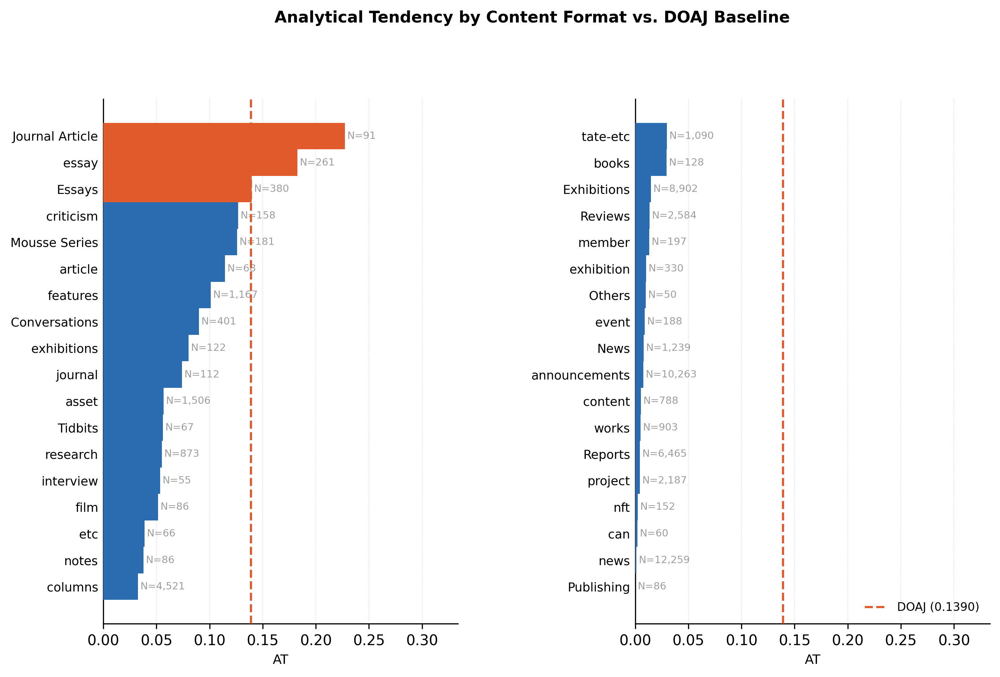
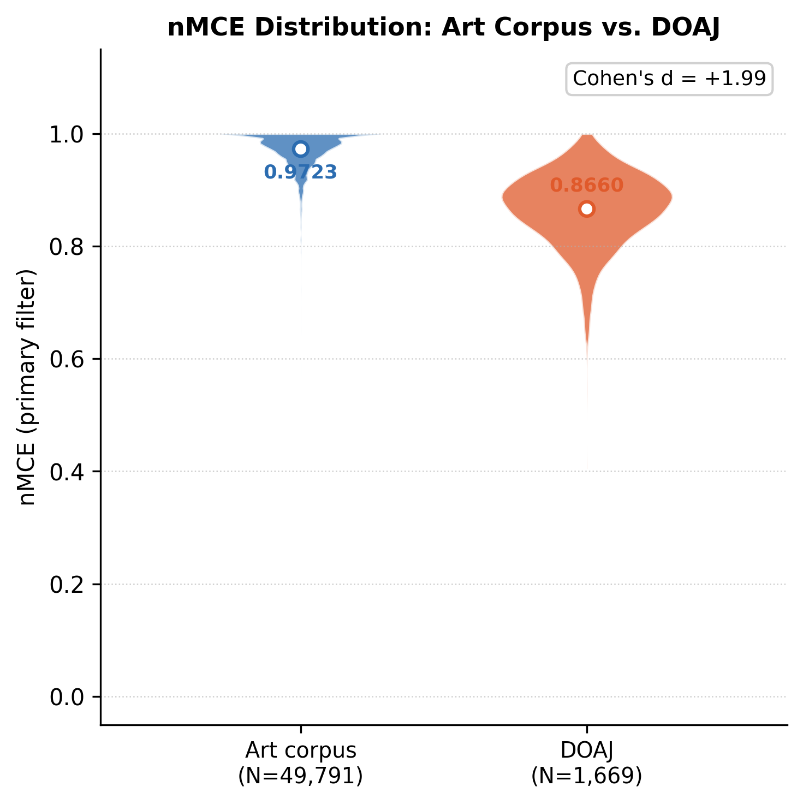
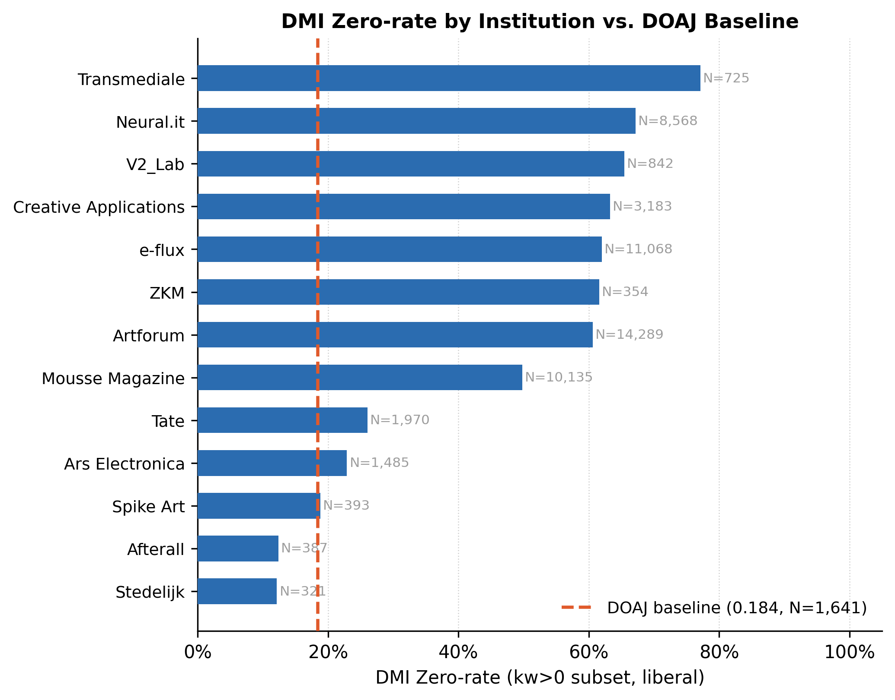
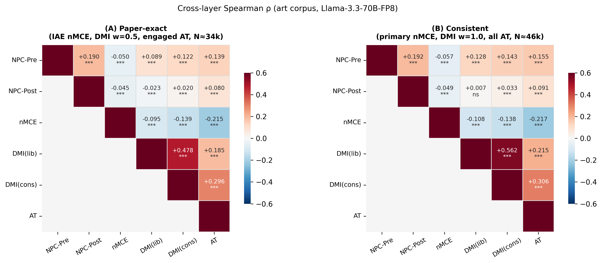

# Figures

All figures are generated from data files in `data/` by running:

```bash
python scripts/generate_figures.py
```

Output files are written to `figures/`. A vertical variant of Fig. 5
(`fig5_crosslayer_heatmap_vertical.png`) is also produced for the main README.

---

## Fig. 1 — Analytical Tendency by Institution


**Caption.** Mean Analytical Tendency (AT) per institution, sorted ascending, with
the DOAJ baseline (dashed line, N = 1,658 documents). AT is defined as the mean
of P(depth=4) + P(depth=5) over all (document, discourse) pairs with non-empty
logprob alternatives, scored by Llama-3.3-70B-Instruct-FP8. Every art institution
falls below the DOAJ baseline (0.139), with Neural.it and V2\_Lab recording the
lowest values (AT < 0.01). Stedelijk, Afterall, and Spike Art are the closest to the
DOAJ baseline. The overall art mean is AT = 0.052 (N = 58,907 documents).
Reproduces the institution-level breakdown in **§7.3, Table 7.2**.

---

## Fig. 2 — Analytical Tendency by Content Format



**Caption.** Mean AT per content format category (url\_category), derived from
`url_category_map.json.gz`. Left panel: formats with higher AT values; right panel:
formats with lower AT values. Both panels share the same x-axis scale and DOAJ
baseline. Orange bars indicate formats that exceed the DOAJ baseline.
Only categories with N ≥ 50 documents are shown. Reproduces the format-level
breakdown in **§7.3, Table 7.3**.

### Content Format Reference

The table below lists every category slug that appears in this figure, along with
the institution(s) that use it and a brief description of the content type.

| Category (as shown) | Institution(s) | Description |
|---|---|---|
| `Journal Article` | Stedelijk | Stedelijk Studies: peer-reviewed journal articles on contemporary art and museum practice |
| `essay` | Afterall, Spike Art | Long-form critical essays accompanying artist features or issues |
| `Essays` | Mousse Magazine, Stedelijk | Editorial essays collected under a named section heading |
| `criticism` | e-flux | Art criticism pieces published in the e-flux journal |
| `Mousse Series` | Mousse Magazine | Thematic editorial series (e.g. artist monograph issues) |
| `article` | Afterall | Standard peer-reviewed journal articles |
| `features` | Artforum | Feature-length editorial texts (profiles, extended criticism) |
| `Conversations` | Mousse Magazine, Stedelijk | Artist and curator interview dialogues |
| `exhibitions` | Spike Art | Exhibition reviews and coverage |
| `journal` | e-flux, Transmediale | Journal or periodical entries |
| `asset` | Ars Electronica | Festival project pages and digital artwork documentation |
| `Tidbits` | Mousse Magazine | Short news briefs and editorial snippets |
| `research` | Tate | Research essays and curatorial research publications |
| `interview` | Afterall | Extended artist or curator interviews |
| `film` | e-flux, Spike Art | Film criticism and film-programme coverage |
| `etc` | Creative Applications, e-flux, Spike Art, Stedelijk, ZKM | Miscellaneous or uncategorised pages across multiple platforms |
| `notes` | e-flux | Short editorial dispatches and curatorial notes |
| `columns` | Artforum | Regular editorial columns (e.g. Scene & Herd, critics' picks) |
| `tate-etc` | Tate | Miscellaneous online-only Tate content (about pages, magazine extras) |
| `books` | Creative Applications, e-flux, Spike Art | Book reviews and publication notices |
| `Exhibitions` | Mousse Magazine | Exhibition reviews and coverage (Mousse capitalised heading) |
| `Reviews` | Mousse Magazine, Neural.it | Exhibition and publication reviews |
| `member` | Creative Applications | Member-exclusive content and announcements |
| `exhibition` | Afterall, ZKM | Exhibition documentation and catalogue texts |
| `Others` | Mousse Magazine | Miscellaneous Mousse Magazine content not assigned a specific section |
| `event` | Creative Applications | Event announcements and coverage |
| `News` | Mousse Magazine, Neural.it, Stedelijk | News items under a capitalised platform section heading |
| `announcements` | e-flux | e-flux event and exhibition announcements |
| `content` | Transmediale | General Transmediale website content pages |
| `works` | V2\_Lab | Artist works and project documentation pages |
| `Reports` | Neural.it | Long-form technology and media art reports |
| `project` | Creative Applications | Digital art and creative technology project pages |
| `nft` | Creative Applications | NFT and blockchain-based art coverage |
| `can` | Creative Applications | Creative Applications Network homepage and index content |
| `news` | Artforum, Creative Applications | News articles (lowercase platform slug) |
| `Publishing` | Mousse Magazine | Artist book and publishing project pages |

---

## Fig. 3 — nMCE Distribution: Art Corpus vs. DOAJ



**Caption.** Violin plot of Normalised Modifier Concentration Entropy (nMCE) under
the primary filter (all adjectives from amod dependencies; ≥ 3 adjective–noun pairs,
K ≥ 2 unique adjectives, total\_nouns ≥ 50). Art corpus: N = 49,791 documents,
mean = 0.9723. DOAJ: N = 1,669 documents, mean = 0.8660. Cohen's d = +1.99
(simple pooled SD). The art corpus is concentrated near the ceiling (nMCE ≈ 1.0),
indicating highly uniform adjective usage — each adjective is paired with many
different nouns, producing near-maximal entropy. The DOAJ distribution is broader
and lower, reflecting more varied modifier deployment. Reproduces **§5.1, Table 5.1**
(primary variant row).

---

## Fig. 4 — DMI Zero-rate by Institution



**Caption.** Proportion of documents with zero Discourse Marker Interaction score
(DMI\_liberal = 0), restricted to documents with at least one keyword match (kw > 0
subset). Art institutions are sorted by zero-rate ascending. DOAJ baseline: 18.4%
(N = 1,641 documents with kw > 0). Across all art institutions, zero-rate
substantially exceeds the DOAJ baseline, indicating that art texts matching
discourse keywords rarely contain the causal or contrastive connectives that would
signal argumentative integration. Stedelijk and Afterall record the lowest art
zero-rates (≈ 30–35%), while Transmediale and Neural.it exceed 85%. Aggregate
Odds Ratio (kw > 0 subset, liberal zero): OR = 5.47 [95% CI: 4.82, 6.20].
Reproduces **§6.1, Table 6.1** and the institution breakdown.

---

## Fig. 5 — Cross-layer Spearman ρ Heatmap



**Caption.** Upper-triangular Spearman rank correlation matrix for five metrics
computed on the art corpus. Two variants are shown side by side:

**(A) Paper-exact** replicates the analysis in §8 exactly: nMCE uses the
IAE/AWL adjective filter; DMI uses the w = 0.5 weighting from the original CSV
output; AT is restricted to documents with at least one engaged pair (p(L=0) < 0.999),
yielding N ≈ 34k documents.

**(B) Consistent** uses uniform settings across layers: primary nMCE (no IAE filter);
DMI with w = 1.0 (recomputed); AT over all documents with non-empty logprob
alternatives (N ≈ 46k).

Key findings: NPC-Post × DMI(lib) ≈ 0 (ns in both variants), confirming
syntactic and discourse-structural independence. nMCE × AT < 0 (ρ ≈ −0.21),
and DMI(cons) × AT > 0 (ρ ≈ +0.30), reflecting distinct dimensions of
surface versus argumentative engagement. Reproduces **§8, Table 8.1**.

Significance codes: \*\*\* p < 0.001, \*\* p < 0.01, \* p < 0.05, ns = not significant.

A vertical layout variant (`fig5_crosslayer_heatmap_vertical.png`) is available
for display contexts where width is constrained.
